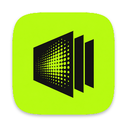
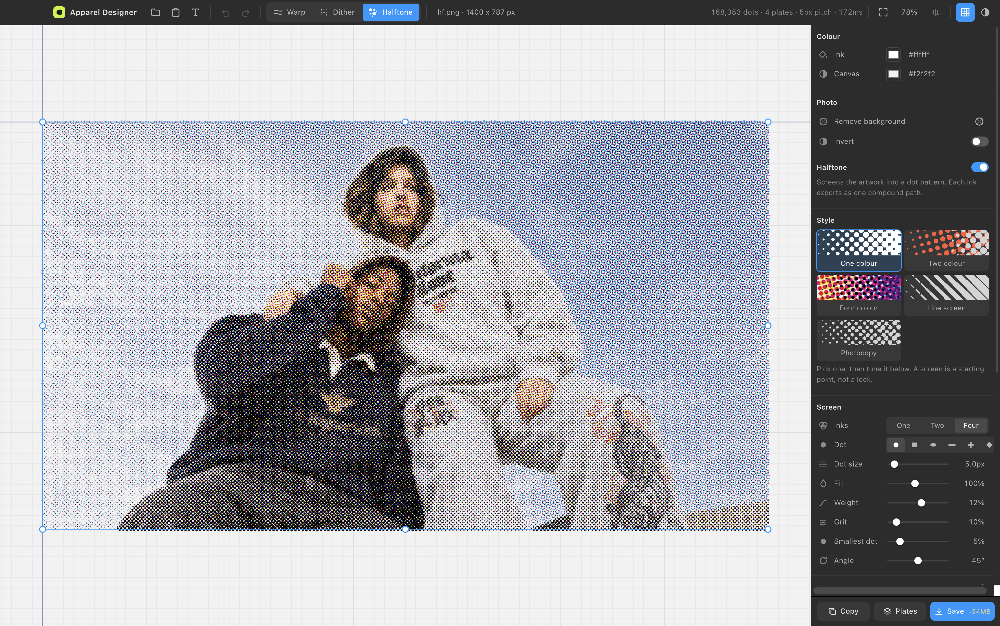
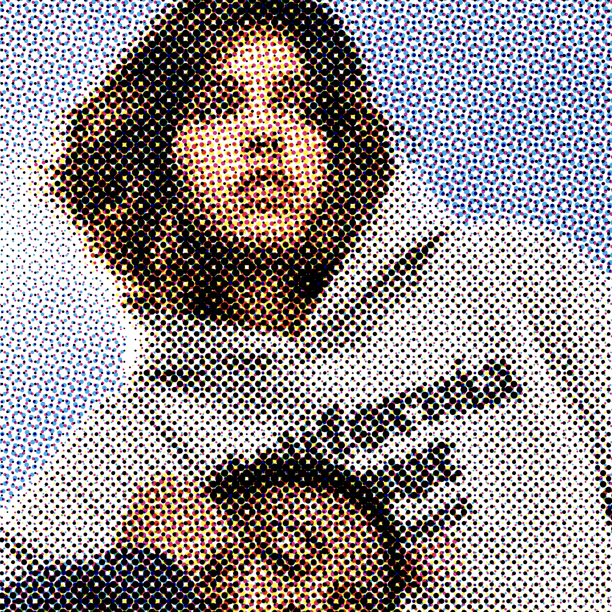
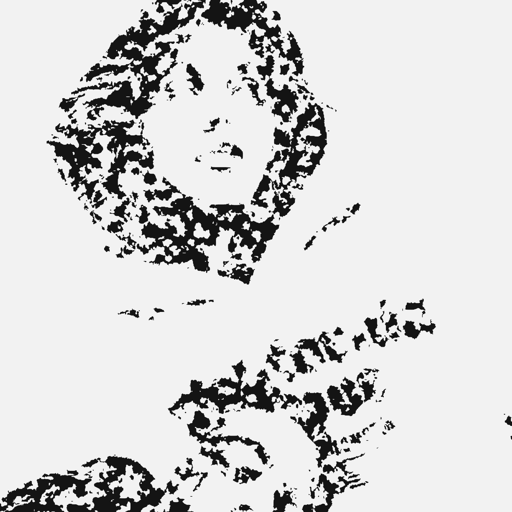
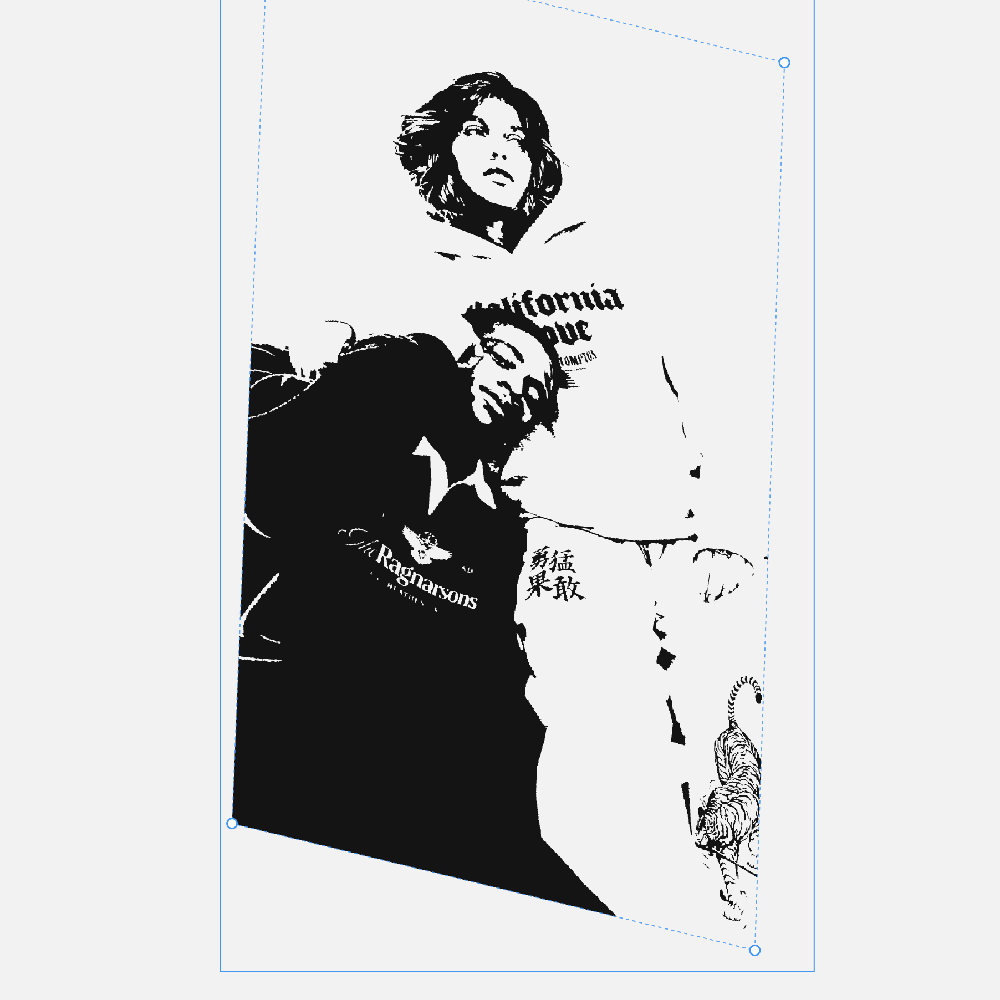
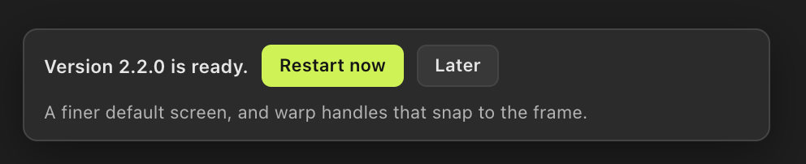

<div align="center">



# Apparel Designer

**Print effects for garment artwork. Vector in, vector out.**

Halftone a photo into a real CMYK dot screen. Chew a logo up with ink erosion and
grunge. Bend artwork onto a garment with four corner handles. Then export the
whole thing as SVG your printer can actually use.

Runs on your own Mac. Nothing is uploaded. No account, no subscription.

### [⬇ Download for Mac](https://github.com/aditya31Sharma/apparel-designer/releases/latest/download/Apparel-Designer-mac-arm64.dmg)

<sub>Apple Silicon · free · MIT licensed · updates itself</sub>



</div>

---

## What it does

| | | |
|:--:|:--:|:--:|
|  |  |  |
| **Four colour halftone**<br><sub>Real screen angles, real dot gain</sub> | **One colour halftone**<br><sub>For a single screen on a tee</sub> | **Ink erosion and grunge**<br><sub>Nine textures, spread, melt</sub> |



### Warp

Four corner handles and 18 deformation presets. Drag a logo into perspective,
arch it, bulge it, wave it. Handles snap to whole pixels and to each other, hold
Cmd to ignore that.

### Halftone

A printing RIP done as geometry, not as a filter. Six dot shapes, real screen
angles, adjustable black generation, paper fibre and ink texture. CMYK, duotone
or one colour. Sized by **dot pitch in pixels**, so a screen you tuned on a logo
behaves the same on a 3000px photo.

### Dither

Signed distance field ink erosion: spatter, pitting, blotching, spread past the
edge, nine grunge textures and a melt pass. The thing that makes a print look
pulled through a screen rather than printed by a machine.

**Start with One colour.** Three recommended styles sit above the full list in
both the Dither and the Halftone panel, and picking one changes every slider
under it, which you are then free to move.

The one that matters on a photo is **Threshold**: it decides how much of the
picture becomes ink before any edge work happens, and it is measured off the
picture when you open it. One fixed number cannot serve both a garment shot with
no background and a drawing that is half white paper, which want thresholds
twenty points apart, and getting it wrong is not subtle: too low and the subject
disappears, too high and everything dark fuses into one silhouette. So the tool
aims at a coverage rather than a level, picking the threshold at which about a
third of the picture is ink, capped so that a bright photograph does not reach up
into the sky behind the subject. A style then applies as the offset it is from
the middle, so choosing a look does not throw the measurement away.

Ink traced out of a photograph is dark ink, and it arrives on paper. It used to
arrive white, on the dark canvas, which is how a correct trace could look like
one white blob.

### Background removal

Cuts the subject out of a photo so the effects stop putting ink on the sky. Runs
a model on your own machine. The image never leaves it.

<br clear="right">

### Everything is vector on the way out

One compound path per ink inside a multiply group, so Illustrator opens four
objects and not a hundred thousand. **Plates** writes each ink as its own named
group, unblended, which is what a printer asks for. The Save button tells you the
file size before you press it.

---

## Getting it

You do not need to know anything about code. Three steps.

**1. Download it.**
[Apparel Designer for Mac](https://github.com/aditya31Sharma/apparel-designer/releases/latest/download/Apparel-Designer-mac-arm64.dmg)

**2. Install it.**
Open the file you downloaded, then drag the app icon onto the Applications
folder shown next to it. That is the whole install.

**3. Open it the first time.**

The app is not signed by Apple, because that costs $99 a year and this is free.
So macOS asks once, the first time only:

- Open **Applications**, double-click **Apparel Designer**
- macOS says it cannot verify the developer. Click **Done**
- Open **System Settings → Privacy & Security**
- Scroll down. There is a line about Apparel Designer. Click **Open Anyway**
- Confirm with your password or Touch ID

That is it, forever. Every launch after that is a normal double-click, and the
app sits in Spotlight and Launchpad like anything else.

> **Something went wrong?**
> If macOS says the app "is damaged and can't be opened", the download was
> interrupted. Delete it and download again.
> [Open an issue](https://github.com/aditya31Sharma/apparel-designer/issues/new)
> and say what happened, and it will get fixed.

**Requirements:** a Mac with Apple Silicon (M1 or newer) on macOS 11 or later.
On an Intel Mac, run it from source instead, see [Building it](#building-it).

---

## It updates itself

Every time you open the app it asks GitHub whether there is a newer version. If
there is, it fetches it in the background and shows this in the corner of the
canvas. Nothing interrupts you, and nothing happens until you say so.



Updates are the app's own source, about a megabyte, not a fresh 150MB download.
If a change needs a whole new build the app tells you that instead and links to
it.

If an update ever fails to start, the next launch notices, throws it away and
goes back to the version that worked. You can also force that from
**Help → Use the Built-in Version**, or check on demand with
**Help → Check for Updates**.

Nothing is sent anywhere during a check. It is one request for a small file.

---

## Using it

| | |
|---|---|
| Open artwork | `Cmd O`, or drag a file onto the canvas, or paste with `Cmd V` |
| Formats in | SVG, PNG, JPEG, WebP, AVIF |
| Formats out | SVG, and separated SVG plates |
| Fit to screen | `Cmd 0` |
| Actual size | `Cmd 1` |
| Save | `Cmd S` |

**Trackpad**

| Gesture | Result |
|---|---|
| Two-finger swipe | Pan, both axes |
| Pinch | Zoom about the cursor |
| Shift and scroll | Pan horizontally |
| Space and drag, or middle-drag | Pan |

Nothing is applied when you open a file, including a photo: it arrives as the
photo, and the first thing that happens to it is the thing you ask for. Switch on
the effects you want, in any combination. Your position, size, rotation, opacity,
fill and stroke survive every one of them.

A photo you have applied nothing to exports as that photo, embedded, because a
file that opens empty is not an export of what was on the canvas. Switch an
effect on and it exports as geometry, which is what the tool is for.

---

## Building it

For an Intel Mac, for another platform, or to change something.

```bash
git clone https://github.com/aditya31Sharma/apparel-designer.git
cd apparel-designer
npm install
npm start                  # run it from source
npm run dist               # build dist/Apparel-Designer-mac-arm64.dmg
```

```bash
npm test                   # 181 engine checks, no browser needed
npm run suite              # 415 checks driving the real desktop build
npm run bench              # timings for every heavy path
npm run shots              # regenerate the screenshots in this README
electron . --sheet         # render every effect over the test images
```

**It will not start from a VS Code terminal.** VS Code exports
`ELECTRON_RUN_AS_NODE`, which makes Electron behave as a plain Node runtime: the
window never appears. The app detects this and says so. Launch it from Finder, or
clear the variable:

```bash
env -u ELECTRON_RUN_AS_NODE open -a "Apparel Designer"
```

### Layout

```
electron/     main process, preload bridge, background removal, updater, harnesses
src/engine/   warp, grunge, halftone, raster, geom, importer, snap   (no DOM)
src/doc/      document model, effect registry, the three registrations
src/view/     viewport, overlay, control specs, panel builder, icons
src/workers/  the effect stack and the erosion pool, off the main thread
src/export/   geometry to SVG
test/         181 checks that need nothing but node
docs/         the download page and the screenshots
```

Adding a fourth effect means one registration in `src/doc/register-effects.js`
and one spec in `src/view/specs.js`. Nothing in the viewport, the exporter or the
transform code has to change.

### Releasing

```bash
npm version minor          # or patch, or major
npm run release            # writes app-version.json, prints what to do next
```

`app-version.json` is what installed copies read. `minShell` in it moves only
when a change touches something a source update cannot replace, at which point
installed copies are told to download a new build rather than updating in place.

---

## How it works

<details>
<summary><b>The halftone screen</b></summary>

A printing RIP, done as geometry:

1. Separate RGB into cyan, magenta, yellow and black, with adjustable black generation
2. Build a summed-area table per channel, so averaging a screen cell of any size is
   four array reads and the cost stops depending on how fine the screen is
3. Lay a square grid per channel, rotated to that channel's screen angle
4. Size each dot so the **ink that lands** matches the tone that was asked for
5. Emit one compound path per ink, composited with multiply

Step 4 is the one worth explaining. A round dot inscribed in its cell can only ever
cover pi/4 of it, so the obvious `r = half * sqrt(coverage)` prints every tone 21%
too light, and past about 70% the dots have to overlap their neighbours in a way no
tidy formula covers across six different dot shapes. So the relationship is measured
rather than derived: one cell of the periodic lattice is rasterised at a range of dot
sizes, and that curve is inverted. The tests assert tone accuracy across the range,
for every shape. It lands within 0.2%.

**The screen is sized by dot pitch, in pixels, not by cells across the artwork.**
Cells-across is relative to the artwork, so a screen tuned on a 400px logo puts 76px
dots on a 2600px photo. Pitch is what "a five pixel dot" actually means and it holds
whatever you feed it. The cell count is derived from the frame at run time.

**Mono and duotone work from perceptual tone, not from the black plate.** Black
generation is `1 - max(r,g,b)`, so a saturated colour contains no black at all
and a red logo came out of a one-colour screen as blank paper. Duotone gives the
colour the whole tone range and eases the dark ink in past an adjustable split,
so the two overprint in the shadows the way a risograph does, instead of being
mono with a tint.

</details>

<details>
<summary><b>Background removal</b></summary>

BiRefNet-lite through `onnxruntime-node`, locally. MIT licensed, which matters
because BRIA's RMBG-2.0 scores a few points higher but ships under a licence needing
a paid agreement for commercial use.

The model is 213MB and is fetched once on first use into the app's data directory,
never bundled. Nothing is uploaded; the image does not leave the machine. About 7
seconds for a 1000px image.

Inference runs in a **separate Node process**. `onnxruntime-node` loads inside
Electron quite happily and then crashes the instant it runs, on every threading and
optimisation setting tried; in plain Node the same model and the same call work
fine. Running it outside also means a fault in native code cannot take the window
down. If the machine has no Node, or the download fails, the app says so and falls
back to a corner-colour cut rather than doing nothing.

The resulting matte feeds the halftone's ink coverage and the dither's trace, so
removing the background genuinely removes it from the vector output rather than
hiding it behind something.

</details>

<details>
<summary><b>How it stays smooth</b></summary>

Three tiers, because a pan should not cost what a render costs:

| Tier | When | What happens |
|---|---|---|
| render | geometry changed | worker computes, main thread builds Path2D once, draws into an offscreen cache |
| present | pan | blit the cache at an offset. No paths touched |
| zoom | pinch | scale the cache during the gesture, re-render crisp 90ms after it stops |

Nothing builds path data as a string during interaction. Contours arrive as an x,y
`Float32Array` plus ring offsets, halftone dots arrive as `[cx, cy, r, phase]` quads,
and both get drawn under a matrix. The `d` string is built only on export.

**The preview is the result.** A held slider used to run something cheaper and
different: the source sampled at 42%, the screen coarsened to 65% of its frequency,
and the erosion grid halved, which in mask pixels meant the grain, the spatter and
the spread all came out more than twice the size. Then the drag stopped and a second
pass replaced it with something else. You aimed at one picture and got another.

There is one fidelity now, and the speed comes from doing less work rather than
different work. One job is in flight at a time, and a change arriving while one is
running replaces whatever was waiting instead of joining a queue behind it: a drag
used to post a job per slider tick and the worker computed every one of them in full,
discarding all but the last. The mask and its distance field are held between ticks,
because grain, spatter, pitting, blotching, bias, density and every texture control
leave all three untouched, and for a photo traced into thousands of contours that is
most of the job. The padding around the mask is rounded to a step of 32px for the same
reason, and for a better one: every noise field is sampled at mask pixel coordinates,
so a padding derived exactly from roughness slid the whole grain pattern sideways as
you dragged roughness.

Four checks in the suite compare the frame drawn mid-drag against the frame after it,
pixel for pixel across 4.4 million of them, on the paths where the two used to differ.

The erosion's pixel pass splits across a pool of workers over shared memory. That
needs cross-origin isolation, which Chromium grants only to http origins, which is
why the desktop build serves itself from a loopback HTTP server rather than from
`file://` or a custom scheme.

**Three things that cost seconds, all found by measuring**

- **`getImageData` after drawing is a GPU stall.** Rasterising a photo through a
  canvas and reading it back cost 190ms on every recompute. The pixels were already
  in hand; resampling them directly took it to 8ms.
- **`Path2D` is quadratic in subpath count.** One path holding 30,000 contours took
  9.5 seconds to build; a thousand took 11ms. Halftone plates hit the same wall on
  every dot shape except round, which uses `arc()` and takes a different route
  inside Chrome: 80,000 cross-shaped dots took 7.3 seconds. Both now split across
  paths of 250 shapes.
- **Resampling by scattering source pixels leaves holes.** Walking the source and
  writing into the destination is fine while downscaling and silently wrong the
  moment the working bitmap is larger: untouched destination pixels stayed black,
  which screened empty transparent space at about 50%.
- **Splitting a path splits its holes off too.** Outlines reach the canvas in
  chunks of 250 subpaths, because a hundred thousand in one `Path2D` is
  quadratic to build. Filled chunk by chunk, every hole that landed in a later
  chunk was drawn as a solid island instead of punched out, so anything past 250
  contours filled in solid: a traced photograph with a texture on it came out as
  a black silhouette and the texture got the blame, because a texture is what
  pushes the contour count over the line. Under 250 it never showed. Each chunk
  is now drawn with `xor` onto a layer, so the chunks together come out as the
  even-odd fill of every ring at once, which is what the exporter got for free
  by writing them all into one path. The file was right the whole time; the
  canvas was disagreeing with the thing it was previewing.
- **`multiply` is priced per draw call.** A screen has to reach the canvas in chunks,
  because piling a hundred thousand subpaths into one `Path2D` is quadratic for every
  dot shape that is not a circle. That is about two thousand fills, and with multiply
  set on each of them a frame took 783ms; the same chunks drawn normally take 117ms.
  Each ink now goes onto a layer of its own and the four are multiplied down at the
  end, which took the frame to 13ms. It is also what the file does: the export writes
  one compound path per ink inside a multiply group, so filling chunk after chunk with
  multiply set was darkening every overlap that straddled two chunks, and the canvas
  was showing shadows the SVG did not have.

Measured at Retina density on a 1080px photo:

| | |
|---|---|
| Halftone slider, round dots | 60ms compute, 6ms frame |
| Halftone slider, cross dots | 195ms compute, 5ms frame |
| Dither slider, traced photo | 65ms compute, 4ms frame |
| Halftone from cold | 86ms |
| Eroded photo from cold | 580-620ms |
| Pan, 95th percentile frame | 18.6ms, which is vsync |
| Heap over 25 recomputes | flat |

Every one of those is the real thing, at the fidelity that gets exported. The slider
numbers used to be 8ms and 77ms, for a picture the tool had no intention of giving
you.

A worker that stops answering is caught after twenty seconds: the app says so,
throws it away, starts a fresh one and retries, and falls back to the main
thread if that keeps happening. A frozen canvas with no explanation reads as the
whole app having hung, which is the worst way to fail.

</details>

<details>
<summary><b>Updating without a code signature</b></summary>

macOS will not let an unsigned bundle replace itself through Squirrel: the updater
checks the running app's code signature before it swaps anything, and on an
unsigned app there is nothing to check. So the usual `electron-updater` route is
closed unless a paid Apple developer account is in the picture.

What is open is that the entire interface and every effect is plain HTML, CSS and
JavaScript with no build step. That source can be replaced on disk and picked up
on the next launch. So the app reads `app-version.json` from this repo, and when
it is behind, fetches that tag's tarball and unpacks `index.html`, `style.css` and
`src/` into its data directory. Those files are served in front of the bundled
ones from then on.

The main process, the preload bridge and anything native are never replaced this
way. A change to those raises `minShell`, and installed copies with an older shell
are told to download a build rather than quietly running source they cannot
support.

Every launch that uses updated source leaves a marker behind until the renderer
reports that it started. Finding that marker still there on the next launch means
the update broke the app, so it is deleted, the version is blocked, and the app
goes back to what it shipped with. `test/update.test.js` covers all of it.

</details>

---

## Licence

MIT. See [LICENSE](LICENSE). The bundled sample outlines are covered separately in
[LICENSE-SAMPLES.md](LICENSE-SAMPLES.md).
